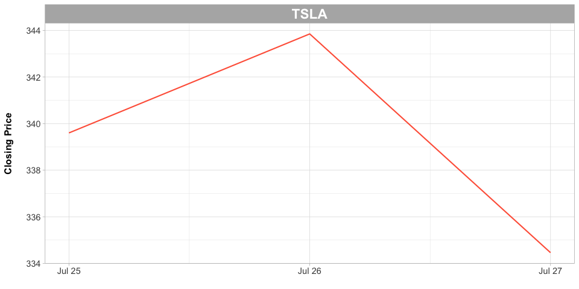

 <h1> Pat and Aaron's $10K TSLA Experiment </h1> 

 
 

## Background

Based on the recommendation of our firm's research analyst, Lisa Baggett, M.D., Pat and Aaron decide to invest $10,000 in Tesla ([TSLA](https://finance.yahoo.com/quote/TSLA?p=TSLA)) on July 25, 2017 at a market closing price of $339.6

 

## Performance

Including a $7.00 cost of trade, as of Thursday, July 27, 2017, we are **down** $-395.

 

Ticker   Date            Open    High      Low    Close   Daily % Change   Daily $ Change   Cumulative Profit Total
-------  -----------  -------  ------  -------  -------  ---------------  ---------------  ------------------------
TSLA     2017-07-25    345.00   345.6   334.15   339.60            -1.57             -157                      -157
TSLA     2017-07-26    340.36   345.5   338.12   343.85             1.03              103                       -54
TSLA     2017-07-27    346.00   347.5   326.29   334.46            -3.34             -334                      -388

